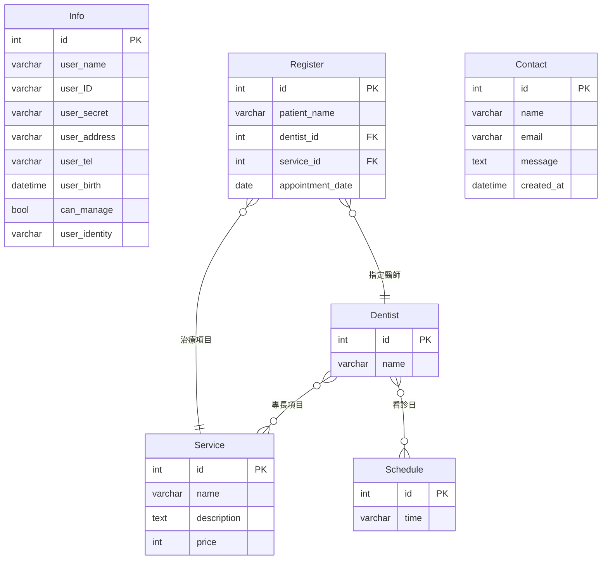

# 牙科診所掛號系統（Dental Clinic Appointment Registration System）

> 網際網路程式設計課程專題｜以 Django 實作的牙科診所線上掛號網站，分為訪客、病患、管理者三種身分，涵蓋註冊登入、線上掛號、掛號查詢，以及醫師、治療項目、病患與預約的後台管理。

---

## 摘要（Abstract）

診所掛號常見的問題有三個：病患要能自己預約；預約必須符合醫師專長與出診日；診所要能即時維護醫師、項目與病患資料。

本專案以 Django 建置一個網頁版掛號系統，採用 MTV（Model–Template–View）架構，前端使用 Bootstrap。病患註冊後可線上掛號，系統會檢查日期、重複預約、醫師專長與醫師出診日。管理者登入後，可維護所有資料，並查看訪客送出的聯絡訊息。

## 研究動機（Motivation）

作者在物件導向課程中，已用 Java 做過牙醫掛號系統，資料存在文字檔，只能單機操作。

網際網路程式設計課程讓這個題目有機會升級：改成瀏覽器操作、資料存進資料庫、多人可同時使用，並加入身分權限與機器人驗證。兩個版本的比較，也能看出桌面應用與網頁應用在架構上的差異。

## 系統功能（Features）

### 訪客

| 功能 | 說明 |
| --- | --- |
| 首頁 | 列出所有治療項目；依登入身分顯示不同按鈕（立即掛號或立即登入） |
| 治療項目 | 以卡片顯示項目名稱、說明與價格 |
| 醫師介紹 | 顯示醫師、專長項目與看診時間；可用關鍵字搜尋醫師名稱、看診日或治療項目 |
| 聯絡我們 | 送出姓名、電子郵件與訊息，資料寫入資料庫 |
| 註冊 | 填寫個人資料並通過機器人驗證 |
| 登入 | 姓名、密碼與驗證碼 |
| 忘記密碼 | 輸入身分證字號與驗證碼後，顯示密碼 |

### 病患

| 功能 | 說明 |
| --- | --- |
| 線上掛號 | 選擇醫師、治療項目與日期，系統依下列規則檢查 |
| 掛號查詢 | 顯示個人預約，依日期排序，並標示「待看診」或「已看診」；可關鍵字搜尋 |
| 個人資料 | 可修改姓名、密碼、地址、電話、身分別；身分證字號與生日不可修改；送出時需通過機器人驗證 |

**掛號檢查規則**

1. 預約日期不可為過去日期。
2. 同一病患在同一天不可重複預約。
3. 所選醫師必須提供所選治療項目。
4. 所選醫師必須在該日期的星期別出診。

### 管理者

管理者頁面皆先檢查登入身分，非管理者會被導向其他頁面。

| 功能 | 說明 |
| --- | --- |
| 預約管理 | 檢視、搜尋、新增、編輯、刪除所有預約 |
| 病患資料管理 | 檢視、搜尋、編輯、刪除病患，可指定是否為管理者 |
| 醫師排班與治療項目 | 新增、編輯、刪除醫師，設定專長項目與看診日 |
| 治療項目管理 | 新增、編輯、刪除項目，價格須為非負數 |
| 回饋訊息管理 | 檢視訪客送出的聯絡訊息 |

### 輸入驗證

| 欄位 | 規則 |
| --- | --- |
| 使用者名稱 | 長度 2–15 字 |
| 密碼 | 至少 6 字元，且不可只有數字或只有字母 |
| 身分證字號 | 10 碼，第 1 碼為英文字母，後 9 碼為數字；不可重複註冊 |
| 電話 | 10 碼數字 |
| 生日 | 格式為 YYYY-MM-DD，不可為未來日期 |
| 身分別 | 一般身份、退伍軍人、領有殘障手冊 |
| 機器人驗證 | 登入、註冊、忘記密碼、修改個人資料皆需通過圖形驗證碼 |

## 系統架構（System Architecture）

```
瀏覽器
  │  HTTP（表單以 POST 送出，附 CSRF Token）
  ▼
Django（URL 路由 → View → Template）
  ├─ basic    公開頁面、註冊登入、資料模型
  ├─ patient  病患掛號、查詢、個人資料
  └─ manager  管理者後台
  │  ORM
  ▼
資料庫（MySQL）
```

| 層級 | 技術 |
| --- | --- |
| 後端框架 | Django 3.2 |
| 前端 | Django Template、Bootstrap |
| 資料庫 | MySQL（utf8mb4）；專案另附 SQLite 範例資料 |
| 機器人驗證 | django-simple-captcha |
| 登入狀態 | Django Session；以自訂 context processor 把身分旗標送進所有模板 |
| 語系與時區 | 繁體中文（zh-hant）、Asia/Taipei |

### 三個 App 的分工

| App | 職責 | 主要檔案 |
| --- | --- | --- |
| `basic` | 首頁、治療項目、醫師介紹、聯絡我們、註冊、登入、登出、忘記密碼；並定義主要資料模型 | `views.py`、`models.py`、`forms.py` |
| `patient` | 掛號、掛號查詢、個人資料，以及 `Register` 模型 | `views.py`、`models.py`、`forms.py` |
| `manager` | 預約、病患、醫師、治療項目、聯絡訊息的管理 | `views.py`、`forms.py` |

### 模板結構

`base.html` 是共用骨架，載入 Bootstrap，並預留標題、樣式與內容三個區塊，再引入 `header.html` 與 `footer.html`。導覽列依登入身分切換：病患、管理者、訪客各顯示不同選單。

## 資料庫設計（Database Design）

共 6 個資料模型。



| 模型 | 用途 | 關聯 |
| --- | --- | --- |
| `Info` | 使用者帳號，同時保存病患資料與管理者旗標 | 以 `can_manage` 區分身分 |
| `Service` | 治療項目，含說明與價格（預設 150） | 與 `Dentist` 多對多 |
| `Schedule` | 星期一到星期日，代表看診日 | 與 `Dentist` 多對多 |
| `Dentist` | 醫師 | 與 `Service`、`Schedule` 各為多對多 |
| `Register` | 預約紀錄 | 多對一連到 `Dentist` 與 `Service` |
| `Contact` | 訪客留言，送出時間自動記錄 | 獨立 |

### 設計說明

- **醫師與項目、看診日皆為多對多。** 一位醫師可有多個專長與多個出診日，Django 自動建立中間表。
- **看診日獨立成 `Schedule` 表。** 只有七筆固定資料。這樣醫師搜尋與掛號檢查都能用一般查詢完成。
- **病患與管理者共用 `Info`。** 以布林欄位區分，簡化登入流程，登入時再依欄位決定導向哪一組頁面。

### 範例資料

專案附有 `db.sqlite3`，內含 7 項治療項目（口腔檢查、全口洗牙、牙周治療、拔智齒、抽神經、臨時假牙、人工植牙）、6 位醫師、7 個看診日，以及少量測試帳號與預約，可用於展示。

## 專案結構（Repository Structure）

```
dental_clinic_appointment_registration_system/
├── manage.py
├── demo/                     # 專案設定（settings、urls、wsgi）
├── context_processors.py     # 把登入身分旗標送進模板
├── basic/                    # 公開頁面、帳號、核心模型
├── patient/                  # 病患功能與預約模型
├── manager/                  # 管理者後台
├── templates/
│   ├── basic/                # 共用骨架、首頁、登入、註冊、醫師、項目、聯絡
│   ├── patient/              # 掛號、查詢、個人資料
│   └── manager/              # 各項管理頁與編輯頁
├── static/                   # Bootstrap 與圖片
├── db.sqlite3                # 範例資料
└── 網際網路程式設計專題報告.pptx   # 程式碼逐頁說明簡報
```

## 網址一覽（URL Routes）

| 路徑 | 功能 | 身分 |
| --- | --- | --- |
| `/` | 首頁 | 全部 |
| `/services/`、`/dentists/`、`/contact/` | 治療項目、醫師介紹、聯絡我們 | 全部 |
| `/logon/`、`/login/`、`/logout/`、`/password_recovery/` | 註冊、登入、登出、忘記密碼 | 全部 |
| `/register/`、`/search/`、`/info/` | 掛號、掛號查詢、個人資料 | 病患 |
| `/register_manage/` 等 | 預約管理（含 edit、delete） | 管理者 |
| `/patient_manage/` 等 | 病患管理（含 edit、delete） | 管理者 |
| `/dentist_manage/` 等 | 醫師管理（含 edit、delete） | 管理者 |
| `/service_manage/` 等 | 治療項目管理（含 edit、delete） | 管理者 |
| `/contact_manage/` | 聯絡訊息 | 管理者 |
| `/admin/` | Django 內建後台 | 超級使用者 |

## 安裝與執行（Installation）

**環境需求：** Python 3.8–3.10、Django 3.2、django-simple-captcha；使用 MySQL 時另需 mysqlclient。

```bash
git clone https://github.com/Fu-Pei-Yin/dental_clinic_appointment_registration_system.git
cd dental_clinic_appointment_registration_system

pip install "django==3.2.*" django-simple-captcha mysqlclient
```

### 方式一：使用 SQLite（快速展示）

1. 開啟 `demo/settings.py`，找到 `DATABASES`。
2. 取消 SQLite 區塊的註解，並註解掉 MySQL 區塊。
3. 執行：

```bash
python manage.py migrate
python manage.py runserver
```

4. 開啟 <http://127.0.0.1:8000/>。

若要使用專案附帶的範例資料，可直接沿用 `db.sqlite3`，略過 `migrate`。

### 方式二：使用 MySQL

1. 建立資料庫與使用者，字元集選 `utf8mb4`。
2. 在 `demo/settings.py` 的 `DATABASES` 填入資料庫名稱、使用者與密碼。
3. 執行 `python manage.py migrate` 與 `python manage.py runserver`。

### 建立管理者

在系統註冊一般帳號後，用 Django 後台或資料庫，把該帳號的 `can_manage` 設為 `True`。也可執行 `python manage.py createsuperuser` 建立 Django 後台帳號。

## 與先前專案的比較（Comparison）

作者先前以 Java 完成同題材的單機版（[dental_appointment_system](https://github.com/Fu-Pei-Yin/dental_appointment_system)）。

| 面向 | 物件導向課程版 | 網際網路程式設計版 |
| --- | --- | --- |
| 介面 | Java Swing 桌面視窗 | 瀏覽器網頁 |
| 資料儲存 | 文字檔 | 關聯式資料庫 |
| 使用者 | 病患 | 訪客、病患、管理者 |
| 掛號類型 | 預約與現場掛號 | 預約掛號 |
| 時段管理 | 每日 30 分鐘一格，衝突時段自動移除 | 以日期為單位，依醫師出診日檢查 |
| 醫師專長 | 讀取文字檔 | 多對多關聯，管理者可維護 |
| 安全機制 | 輸入格式驗證 | 加上 CSRF、機器人驗證與權限檢查 |

## 限制與未來工作（Limitations and Future Work）

**限制**

- 密碼以明碼儲存，登入時直接比對，忘記密碼功能也直接顯示密碼。
- 忘記密碼只需要身分證字號與驗證碼，未驗證其他身分資訊。
- 預約以日期為單位，同一醫師同一天的人數沒有上限，也沒有時段。
- `Register` 以病患姓名字串記錄，未連到 `Info`。姓名重複或改名時，預約可能對應錯人。
- 登出時會清除資料庫中所有使用者的 Session，而不只是目前使用者。
- 病患在掛號查詢頁輸入關鍵字時，搜尋範圍是全部預約，而不只是自己的預約。
- 專案內的資料庫連線設定與 `SECRET_KEY` 直接寫在 `settings.py`，且 `DEBUG` 為開啟狀態，僅適合開發環境。

**未來工作**

- 改用 Django 內建的使用者與密碼雜湊機制，忘記密碼改為寄送重設連結。
- 加入時段與每診人數上限，避免同一時間過度集中。
- 把 `Register` 改成外鍵連到 `Info`，並讓病患只能搜尋自己的紀錄。
- 登出時只清除目前使用者的 Session。
- 把資料庫帳密與 `SECRET_KEY` 移到環境變數，正式部署時關閉 `DEBUG`。
- 補上 `requirements.txt` 與單元測試。

## 作者（Author）

傅珮茵（Fu Pei-Yin）
國立中興大學 資訊管理學系
